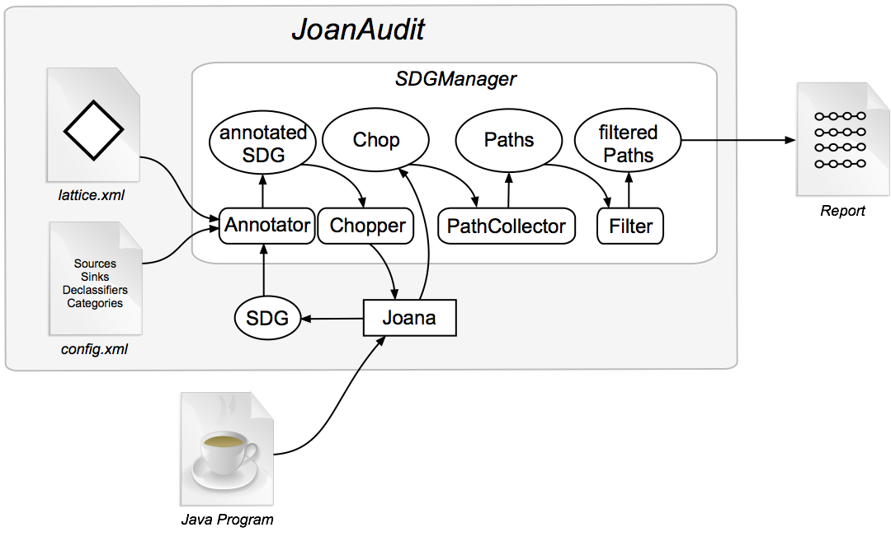

# JoanAudit

[Screencast](#screencast)

[Overview](#overview)

[Installation and Usage](#installation-and-usage)

[Configuration](#configuration)

[Test subjects](#test-subjects)

[Publications](#publications)

[References](#references)


# Screencast

The [screencast](https://www.youtube.com/watch?v=76lmzG_dg20) of JoanAudit is
made available on YouTube. The slides of the screencast can be downloaded from
[here](https://www.dropbox.com/s/4yksan4ksvtub6w/ESEC%3AFSE2017Demo.pdf?dl=1).


# Overview

JoanAudit is a security slicing tool for auditing common injection
vulnerabilities. Security slices are concise and minimal pieces of code that
are essential for auditing XML, XPath, and SQL injection--common and serious
security issues for Web applications and Web services. JoanAudit is based on
the [Joana](http://pp.ipd.kit.edu/projects/joana/) framework which may be
downloaded from [here](https://github.com/jgf/joana).



The general overview is depicted in the figure above. The user configures a
lattice (a partial order relation) and provides a list of source, sink and
declassifier bytecode signatures with their respective security levels
configured in the `config.json` file.  Sources are functions that give access
to data from the environment (e.g. `getParameter()` or `System.getProperty()`);
sinks are security-sensitive operations where data might flow to (e.g.
`executeQuery()`); and declassifiers are functions that sanitize user-provided,
potentially malicious input (e.g. `encodeForSQL()`).  


By means of Joana, JoanAudit generates a System Dependence Graph (SDG) from the
Java bytecode and automatically annotates the latter based on a pre-defined
list of sources, sinks and declassifiers.  Afterwards, JoanAudit creates a list
of security slices between sources and sinks, by first generating program
chops, i.e. the intersection of forward- and backward slices from the sources
and sinks, respectively, and then filters out those paths which can be
considered as secure or irrelevant. 

The output of JoanAudit is a report that lists potentially vulnerable paths of
the program.  

# Configuration

This section explains the JoanAudit configuration in detail (depicted as
`config.json`) in the overview figure. Please note that the `config.json` file
is actually generated by joining all files in the `config/` directory of this
git repository together. However, the default configuration should be
sufficient for the majority of use cases. In case you just want to tailor
JoanAudit to your use case (adding new sources/sinks/desclassifiers), you can
directly jump to [this section](#sources-sinks-declassifiers). As depicted
below, the configuration consists of several parts:

The JoanAudit configuration `config/` includes configurations for source, sink
and declassifier signatures, a configuration part for the lattice
(`lattice.json`), exclusion rules (`exclusions.json`), i.e. a set of Java
packages or classes that can be dropped during the SDG construction, as well as
irrelevant functions (`irrelevant.json`) that are not traversed when performing
the slicing. Moreover, the configuration includes a set of entrypoints
(`entrypoints.json`), i.e. the starting points for SDG construction.  Analysis
profiles can be configured in `profiles.json`: if sources, sinks and
declassifiers are connected by a path but are not semantically related,
they can be filtered out. The file `autofix.json` contains mappings from sinks to
declassifier and context patterns that a string, which is used in a sink, has
to match in order to identify an appropriate declassifier to fix the
vulnerability. The following subsections explain the different parts of the
configuration in detail.

## Security Lattice

A security lattice is used for information flow analysis. More specifically, it
is used to augment parts of the SDG with security labels for the purpose of
performing IFC on potentially sensitive paths (from sources through
declassifiers to sinks). We are using IFC to filter out those paths that can be
considered as secure.

A lattice is a partial ordered set of security levels. The configuration file
`lattice.json` illustrates the configuration of a [diamond
lattice](https://www.cs.cornell.edu/andru/papers/csfw04.pdf) as depicted in the
figure below. The root object `lattice` contains `levels` sub-objects that
define the different security levels of the lattice, whereas the `<=`
array contains the relations between them. Each `level` element object
contains the name of the security level to be used (`label`) and a short
description text (`desc`). The `<=` (smaller equals) array defines the
actual relation between the security levels. The attribute `lhs` stands for
left hand side (the left side of the smaller or equals operation) whereas `rhs`
is the right hand side.  The levels that are defined in `lattice.json` can be
used to label sources, sinks and declassifiers in their respective
configuration files.

``` json
{
  "lattice": {
    "levels": [
      {
        "desc": "non-confidential and trusted",
        "label": "LH"
      },
      {
        "desc": "confidential and trusted",
        "label": "HH"
      },
      {
        "desc": "nonconfidential and untrusted",
        "label": "LL"
      },
      {
        "desc": "confidential and untrusted",
        "label": "HL"
      }
    ],
    "<=": [
      {
        "lhs": "LL",
        "rhs": "HL"
      },
      {
        "lhs": "HH",
        "rhs": "HL"
      },
      {
        "lhs": "LH",
        "rhs": "LL"
      },
      {
        "lhs": "LH",
        "rhs": "HH"
      }
    ]
  }
}

```


## Sources, Sinks, Declassifiers

``` json
{
  "sources": [
    {
      "category": "parameter tampering",
      "tag": "src_pt",
      "sig": [
        {
          "name": "javax.servlet.ServletRequest.getParameter(Ljava/lang/String;)Ljava/lang/String;",
          "labels": "return(LL)"
        }]
    }]
}
```

Sources, sinks and declassifiers are configured by means of JSON arrays in the
configuration files `sources.json`, `sinks.json` and `declassifiers.json`. The
code listing above shows a sample configuration file for sources.  The objects
contained in this array specify the category of the sink, a tag which is
essentially a shorthand for the category and the `sig` array which is the set
of bytecode signatures belonging to the category. The `labels` property assigns
a security label to a parameter of the bytecode signature which can then be
used for declassification.

The categorization of sources, sinks and declassifiers has the following
advantages:

- We can just consider sources/sinks and declassifiers that belong to the same
  category.
- We can create profiles for applications. If a developer has some knowledge
  about the internals of the application (which is usually the case), he may
  just consider those classes of sources, sinks and declassifiers that are of
  interest to him.

The properties `category` and `tag` can be freely defined.  However, it is
important to note that `tag` is used by JoanAudit to match given signatures
with each other (Profiling).  The `labels` attribute should match the following
regular expression: `(return|all|[0-9]+)(security-level)`:

* return: Return node of the function is labeled.
* all: The whole function entry is labeled.
* [0-9]: Actual parameter with the given number is labeled (first actual
  parameter for member functions has index 1 whereas the first parameter of a
  static methods is 0).
* security-level : The security label that is used for the selected part. The
  configuration of this part depends on the lattice configuration where
  security levels are defined through the `label` attribute. In our diamond
  lattice example, security-level could be one of `LL`, `HH`, `LH` or `HL`.

In the example above, the return value of `getParameter()` is labeled with the
`LL`.

The configuration for sinks (depicted below) looks exactly the same as compared to
the configuration of sources; the only difference is the name of the key of the
top-level property which is `sinks` instead of `sources`. In the example below,
we label the first parameter of `executeQuery()` with the security label `HH`.

``` json
{
  "sinks": [
    {
      "category": "sql injection",
      "tag": "snk_sqli",
      "sig": [
        {
          "name": "java.sql.Statement.executeQuery(Ljava/lang/String;)Ljava/sql/ResultSet;",
          "labels": "1(HH)"
        }]
    }]
}


```

Besides sources and sinks, there is also the declassifier configuration listed
below.

``` json
{
  "declassifiers": [
    {
      "category": "sql injection",
      "tag": "dcl_sqli",
      "sig": [
        {
          "name": "org.owasp.esapi.Encoder.encodeForSQL(Lorg/owasp/esapi/codecs/Codec,Ljava/lang/String;)Ljava/lang/String;",
          "labels": "1(HL>HH)"
        }]
    }]
}
```

By and large, the declassifier configuration is the same as compared to sources
and sinks with two exceptions: the name of key of the top-level property must
have the value `declassifiers`, and the structure of the attribute `parlabels`
has to match the regular expression `(return|all|[0-9]+)(security-level0 >
secuirty-level1)` whereas `securitylevel0` is the required, and
`security-level1` is the provided security level. The required security level
imposes the restriction on arriving information to have a security level
smaller then or equal to than `securityLevel0`; `securityLevel1` is the
security-level to which the arriving information should be declassified.
Declassification only makes sense if `security-level1` is smaller or equals
than `security-level0` according to the defined partial order relation in the
security lattice. In our example above, we declassify the information that
passes through the first parameter of `encodeForSQL()` from `HL`
(confidential and untrusted) to `HH` (confidential and trusted). In other
words, we are lowering the cautiousness of data that passes through the
`encodeForSQL()` since it prevents malicious users from launching SQL injection
attacks. `HH` data can be used more freely than `HL` data.

## Exclusions and Irrelevant functions

Exclusion rules are useful for improving scalability by reducing the SDG
construction time. The following snippet illustrates a sample
configuration for excluding three packages from the SDG build process. 

``` json
{
  "exclusions": [
    "javax/swing/event.*",
    "javax/swing/text.*",
    "javax/swing/table.*",
  ]
}
```

The configuration file for irrelevant functions is structured similarly.
However, irrelevant procedures are kept in the SDG and are ignored in the
slicing phase.

## Entrypoints

Entrypoints are starting points for the SDG generation. JoanAudit analyzes the
bytecode and searches for possible entrypoints based on the patterns configured
in `entrypoints.json`. The following code snippet configures 3 possible
entrypoints, namely `doPost()`, `doGet()`, `service()` which share the same
`prefix` (member functions of the same class). JoanAudit searches for
entrypoints with matching signatures, i.e. all entrypoints that exactly match,
extend or implement the entrypoint class.

``` json
{
  "entrypoints": [
    {
      "prefix": "javax.servlet.http.HttpServlet",
      "suffix": [
        "doPost(Ljavax/servlet/http/HttpServletRequest;Ljavax/servlet/http/HttpServletResponse;)V",
        "doGet(Ljavax/servlet/http/HttpServletRequest;Ljavax/servlet/http/HttpServletResponse;)V",
        "service(Ljavax/servlet/http/HttpServletRequest;Ljavax/servlet/http/HttpServletResponse;)V"
      ]
    }]
}
```

## Profiling

The categorization of sources, sinks and declassifiers helps to reduce the
amount of potentially vulnerable paths that might be reported by JoanAudit and,
hence reduces the manual effort for security auditors.

Categorizing sources, sinks and declassifiers is useful for grouping
them based on their semantic connection; for example, the
sanitization function `encodeForSQL()` sanitizes strings that can be used
safely as parameter of `executeQuery()`. But a flow of a string that contains
the result of `encodeForSQL()` to an XPath sink cannot be considered as safe.

This mechanism allows security auditors to configure JoanAudit according to
their needs. They can configure their own analysis profile to focus their
auditing task just on those vulnerability types in which they are interested
in.  According to the configuration snippet below, only sources of the category
`src_cp`, `src_pt` (as configured in `sources.json`), declassifiers of the
category `dcl_sqli`, `dcl_prep` (as configured in `declassifiers.json`), and
sinks of the category `snk_sqli` and `snk_prep` (as configured in `sinks.json`)
are matched.

``` json
{
  "profiles": [
    {
      "name": "sqli",
      "set": [
        "src_cp",
        "src_pt",
        "dcl_sqli",
        "snk_sqli",
        "dcl_prep",
        "snk_prep",
      ]
    }]
}
```


# Installation and Usage

The tool is a single, self-contained `jar` file that can be executed from the
command line.  

If you would like to try JoanAudit, please have a look the `Dockerfile` in the
`docker/` directory of this repository. You can create the JoanAudit container
by invoking the following instruction from inside the `docker/` directory:

``` bash
docker build -t joanaudit .
```

For running the container, please execute the following command:

``` bash
docker run -p 80:80 -p 8080:8080 -p 2222:22 joanaudit
```

Please note the port mappings of the ports 8080 (tomcat), 22 (ssh) and 80
(http) which we require to get access to WebGoat, JoanAudit
and to the generated HTML report, respectively.

Afterwards, you should be able to see the WebGoat login page when typing the
URL `http://localhost:8080/WebGoat-5.4/attack` into the address bar of you
browser. Furthermore, you should be forwarded to the apache default page when
typing `http://localhost:80` in the address bar of your browser, and `ssh -p
2222 root@localhost` (with password `root`) should open up and SSH connection
to the container.

After connecting via SSH to the container, you will find the JoanAudit binary
in the `/opt/joanaudit` directory.

After generating the report, you can open it by visiting
`http://localhost:80/joanaudit-report` with your browser.

## Tool usage

Before running JoanAudit, please set the environment variable
`JAVA_HOME` by executing following command:

``` bash
export JAVA_HOME="<path>"
```

JoanAudit can be executed with the following command:

``` bash
java -jar joanaudit.jar <options>
```

For looking at the different command line options provided by JoanAudit, please
type the following command:

``` bash
java -jar joanaudit.jar -h
```

The following table explains the meaning of the different options:

| JoanAudit (short/ long option)        | meaning |
| :---------------------------------------------------- | :--------------------------|
| -arch,--archivepath <arch>           | Path to the jar file |
| -cfg,--config <cfg>                  | Path to the JoanAudit configuration file in JSON format |
| -cp,--classpath <cp>                 | Classpath - multiple entries can be separated with ':' |
| -dir,--directorypath <dir>           | path to the directory containing the Java classes |
| -dump,--dump-class-hierarchy         | Dump the class hierarchy |
| -ept,--entrypoint <entrypoint>       | The entrypoint to start the analysis |
| -h                                   | print this message |
| -in,--sdg-in-file <inputfile>        | read the SDG file |
| -lept,--list_entrypoints             | List all possible entrypoints |
| -maxpath,--maximal-paths <maxpath>   | number of path considered per source-sink pair |
| -repfmt,--report_format <arg>        | report formats (JSON|HTML) |
| -repout,--report_out_dir <arg>       | report destination (directory in which the report will be created |
| -sdgout,--sdg-out-file <outputfile>  | serialize the SDG to a file |
| -src,--link_sources <arg>            | links to java sources |


## Listing possible entrypoints

Every function can be defined as entrypoint. JoanAudit searches for entrypoints
that are configured in the `entrypoints.json` file.

``` bash
java -jar joanaudit.jar -arch foo.jar -lept -cfg ./config -cp "lib.jar" 
```


The option `arch` is devoted to the `jar` archive of the program to be
analyzed.  The `lept` options is used for printing out all entrypoints that are
present in the application. The `cfg` options tells JoanAudit where to find its
configuration. The `cp` option is used for including additional libraries (e.g.
stubs) required for constructing the SDG. In case of multiple libraries, you
can separate them using `:`. A possible output after executing the command
above may be:

``` bash
ept: simple.Simple.doGet(Ljavax/servlet/http/HttpServletRequest;Ljavax/servlet/http/HttpServletResponse;)V
ept: simple.Simple.doPost(Ljavax/servlet/http/HttpServletRequest;Ljavax/servlet/http/HttpServletResponse;)V
```


## Printing potentially vulnerable paths

After picking one of the entrypoints that were returned from the execution of
the command above, we can start the analysis of the program with the following
command:

``` bash
java -jar joanaudit.jar -arch foo.jar \
    -ept "simple.Simple.doPost(Ljavax/servlet/http/HttpServletRequest;Ljavax/servlet/http/HttpServletResponse;)V" -cfg ./config -cp "lib.jar" \
    -src .simple-src/ -repout /var/www/html \
    -repfmt HTML
```

JoanAudit might produce the following report consisting of an overview page
which lists all vulnerable paths that have been found. After clicking on one of
the paths (row in the overview table), you will be redirected to a more
detailed view which gives you the details about all the program statements
which are involved in a vulnerability.


# Test subjects

In our experiments, we evaluated JoanAudit on the following test subjects:

* [WebGoat 5.2](https://www.owasp.org/index.php/Category:OWASP_WebGoat_Project):
  a deliberately in-secured Web application/service for the purpose of teaching security vulnerabilities
* [Apache Roller 5.1.1](http://roller.apache.org/): a blogging application with Web Service APIs
* [Pebble 2.6.4](http://pebble.sourceforge.net/): a blogging application with Web Service APIs
* [Regain 2.1.0](http://regain.sourceforge.net/download.php?lang=de): a production-grade search engine used internally by one of the biggest drug stores in Europe
* [pubsubhubbub-java 0.3](https://code.google.com/p/pubsubhubbub/): the most popular Java project related to the PubSubHubbub protocol in the Google Code archive
* [rest-auth-proxy](https://github.com/kamranzafar/rest-auth-proxy): an LDAP micro-service
* [TPC-(APP|C|W)](http://www.tpc.org/tpc_app/): standard security benchmark accepted as representative of real environments by the Transactions processing Performance Council


# Publications

* Julian Thomé, Lwin Khin Shar, Lionel Briand, *Security Slicing for Auditing
  XML, Path and SQL Injection Vulnerabilities*, ISSRE, 2015
  [http://orbilu.uni.lu/handle/10993/21795](http://orbilu.uni.lu/handle/10993/21795)

* Julian Thomé, Lwin Khin Shar, Domenico Bianculli, Lionel Briand *Security
  Slicing for Auditing Common Injection Vulnerabilities*, JSS, 2017
  [http://orbilu.uni.lu/handle/10993/29924](http://orbilu.uni.lu/handle/10993/29924)

* Julian Thomé, Lwin Khin Shar, Domenico Bianculli, Lionel Briand *JoanAudit: A
  Tool for Auditing Common Injection Vulnerabilities*, ESEC/FSE, 2017
  [http://orbilu.uni.lu/handle/10993/31717](http://orbilu.uni.lu/handle/10993/31717)

# References

* [Joana Website](http://pp.ipd.kit.edu/projects/joana/)
* [Joana Source Code](https://github.com/jgf/joana)
* [Declassification/Lattice](https://www.cs.cornell.edu/andru/papers/csfw04.pdf)
